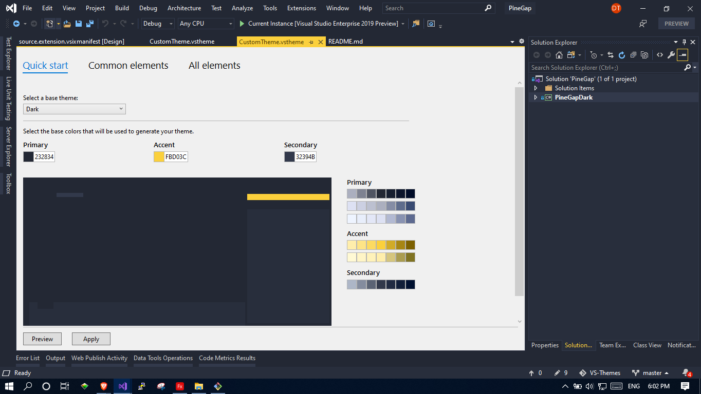

# Pine Gap - Dark

Pine Gap is a visual studio IDE theme extension

[Github Repository](https://github.com/neon-clouds/pinegapdark)
<!-- ## To-Do List
### Language Color Themes
#### 1. Global Defaults
[] Strings - Green(#98c379) -->
## Screenshots

### Theme Creator

